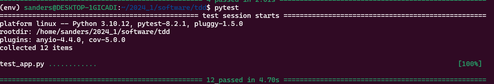
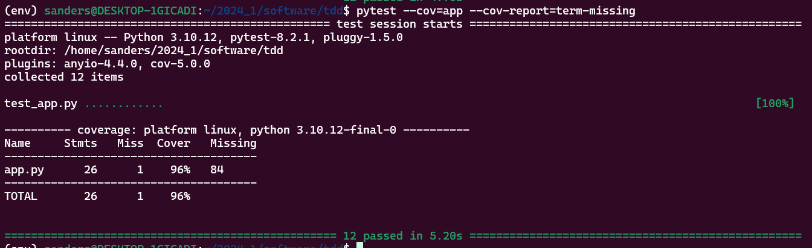
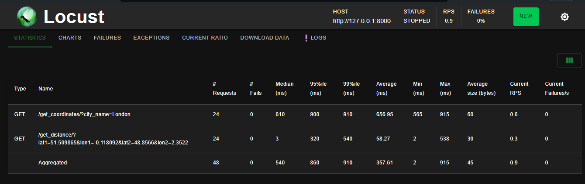

# Activity: Unit Tests and Test Driven Development

This activity demonstrates the implementation of a RESTful API with FastAPI that provides endpoints to retrieve geographical coordinates for a city and calculate the distance between two geographical points. The code is structured to promote maintainability, readability, and adherence to best practices in software development

## Libraries Used

This project utilizes the following Python libraries:

- **FastAPI**: A modern, fast web framework for building APIs with Python 3.7+ based on standard Python type hints.
- **Uvicorn**: A lightning-fast ASGI server implementation, used to serve FastAPI applications.
- **Geopy**: Used for calculating distances between geographic coordinates.
- **pytest**: A framework that allows for easy creation of simple, yet scalable, tests for your applications.

## API's Used

### Nominatim API (OpenStreetMap)

- **Description**: The Nominatim API by OpenStreetMap is used to retrieve geographical coordinates (latitude and longitude) based on city names. This API is open-source and provides detailed geolocation data, which is crucial for the `/get_coordinates/` endpoint in our application.
- **API URL**: [Nominatim API](https://nominatim.org/release-docs/latest/api/Overview/)
- **Documentation**: https://operations.osmfoundation.org/policies/nominatim/

> **Note**: It is important to use a specific `User-Agent` header in requests to the Nominatim API. The use of a generic `User-Agent` (such as `python-requests` default) is discouraged and may result in reduced API performance or access restrictions. In this project, we use `'User-Agent': 'Testing App'` to ensure compliance with Nominatim's usage policies.

## Project Structure

- **app.py**: The core application file where the FastAPI app and routes are defined.
- **test_app.py**: Contains all unit test.
- **locustfile.py**: Used for stress testing the application.
- **requirements.txt**: Lists all project dependencies.

## Evidences

### Unit-Test

`pytest`

### Test-Coverage

`pytest --cov=app --cov-report=term-missing`

### Stress-Tests

`locust -f locustfile.py`

- Once Locust is running, open a web browser and go to [http://localhost:8089](http://localhost:8089) to access the Locust web interface.
- Here you can specify the number of users to simulate, the spawn rate, and start the stress testing.

